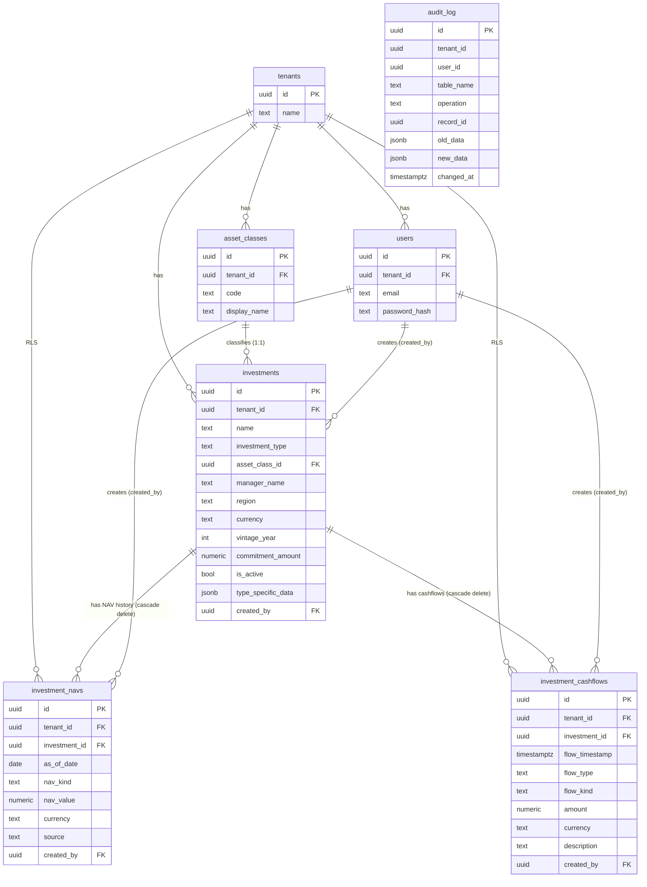

# Phase 4 Acceptance Report

- **Date:** 2026-05-06
- **Phase:** 4 — Investment Domain Schema and Excel Transformation
- **Reporter:** Claude Code (Opus 4.7) — pending visual / functional
  verification by the PortfoliFLOW project owner during the
  Sub-Strang 4e browser walkthrough
- **Branch:** `web-migration`
- **Tag (planned):** `phase-4-complete` — applied after the project owner's sign-off

---

## 1. Summary

Phase 4 is **functionally complete and pending final functional sign-off**.
The investment domain — three new RLS-protected, audit-logged tables
(`investments`, `investment_navs`, `investment_cashflows`) — is in
production-shape, the web CRUD surface (Sub-Strang 4b) is end-to-end
functional with CSRF and audit trail, and the asynchronous Excel
transformation (Sub-Strang 4c) executes the replace-by-investment plus
soft-delete-with-reactivation contract from ADR-0043 §3.

- **Schema decision (ADR-0043 §1):** flat polymorphic `investments`
  table with a seven-value `investment_type` discriminator;
  Plan / Actual parallelism on both NAVs and cashflows. The
  `type_specific_data` JSONB column is reserved but unused in Phase 4.
- **Excel-import path (ADR-0043 §3):** the Phase-2 JSONB substrate
  (`data_uploads` / `data_upload_sheets`) is unchanged;
  `POST /api/data-uploads/{upload_id}/import-as-investments`
  asynchronously transforms a snapshot into normalised rows, with
  partial-success error reporting and `?dry_run=true` preview.
- **Audit, RLS, isolation:** every Phase-4 write fires the
  `audit_trigger_function` from b001 with non-NULL `tenant_id` and
  `user_id`; cross-tenant write attempts surface as 404 (RLS hides the
  foreign row from the active tenant).
- **Test count:** 939 passing, 2 skipped (804 baseline at the
  `phase-3-complete` head `c0970c4`; **+135 net new Phase-4 tests**
  across schema regression, repository audit / isolation, service,
  extractor, transform, web read / write / audit / import routes, and
  chart-spec coverage).
- **Performance sanity check:** at 100 investments × (10 plan + 10
  actual) NAVs × (25 plan + 25 actual) cashflows the list and detail
  routes both render in single-digit milliseconds (well below the
  200 ms / 300 ms acceptance thresholds; see §7).

Acceptance is contingent on the project owner walking the browser checklist in §11.

---

## 2. Phase-4 Scope Recap

| Area                                | Phase 4 delivers                                                                                          | Phase 4 explicitly defers                                       |
|-------------------------------------|-----------------------------------------------------------------------------------------------------------|------------------------------------------------------------------|
| Investment-domain schema            | Three tables: `investments`, `investment_navs`, `investment_cashflows`. Migration b006. RLS + audit + indices. | Type-specific schema (per-type side tables), per-type analytics. |
| Plan / Actual parallelism           | `nav_kind` + `flow_kind` discriminators; plan and actual coexist; neither overwrites the other.            | Plan versioning as a first-class column.                         |
| Excel transformation                | `POST /api/data-uploads/{upload_id}/import-as-investments`, replace-by-investment, soft-delete-with-reactivation, idempotent. | Sektor / Country breakdown normalisation.                        |
| Web CRUD surface                    | List, detail, new, edit, delete, activate / deactivate; per-investment NAV chart and cashflow table; CSRF on every mutating route. | GUI-side migration onto Postgres (the GUI still uses the in-memory DataStore). |
| Asset-class linkage                 | 1:1 FK `investments.asset_class_id` → `asset_classes`. `"unclassified"` per-tenant fallback bootstrapped idempotently. | M:N investment-to-asset-class weights.                           |
| Currency                            | Free-form TEXT with ISO-4217 convention.                                                                  | `currencies` stammtabelle, FX-rate substrate.                    |
| Cross-module API                    | `AssetClassRepository.get_by_code()` upgraded to case-insensitive (concrete consumer in 4c).               | Speculative cross-module helpers without a consumer.             |

---

## 3. Schema-Structural Verification

### 3.1 Schema-Regression Guard

The dynamic `pg_class` / `pg_policy` walker in
`tests/regression/test_rls_schema_invariants.py` includes the three
Phase-4 tables automatically (the baseline pair of tests scans every
`relkind = 'r'` row in the `public` schema except `alembic_version`)
and is additionally parametrised over the three new names.

```
$ pytest tests/regression/test_rls_schema_invariants.py -v
============================= test session starts ==============================
collected 14 items

tests/regression/test_rls_schema_invariants.py::test_every_domain_table_has_rls_enabled PASSED [  7%]
tests/regression/test_rls_schema_invariants.py::test_every_domain_table_has_at_least_one_policy PASSED [ 14%]
tests/regression/test_rls_schema_invariants.py::test_portfoliflow_app_role_does_not_bypass_rls PASSED [ 21%]
tests/regression/test_rls_schema_invariants.py::test_phase_2b_auth_tables_have_rls[sessions] PASSED [ 28%]
tests/regression/test_rls_schema_invariants.py::test_phase_2b_auth_tables_have_rls[login_audit] PASSED [ 35%]
tests/regression/test_rls_schema_invariants.py::test_phase_2d_data_upload_tables_have_rls[data_uploads] PASSED [ 42%]
tests/regression/test_rls_schema_invariants.py::test_phase_2d_data_upload_tables_have_rls[data_upload_sheets] PASSED [ 50%]
tests/regression/test_rls_schema_invariants.py::test_phase_3b_saa_tables_have_rls[asset_classes] PASSED [ 57%]
tests/regression/test_rls_schema_invariants.py::test_phase_3b_saa_tables_have_rls[saa_configurations] PASSED [ 64%]
tests/regression/test_rls_schema_invariants.py::test_phase_3b_saa_tables_have_rls[saa_asset_class_inputs] PASSED [ 71%]
tests/regression/test_rls_schema_invariants.py::test_phase_3b_saa_tables_have_rls[saa_correlations] PASSED [ 78%]
tests/regression/test_rls_schema_invariants.py::test_phase_4a_investment_tables_have_rls[investments] PASSED [ 85%]
tests/regression/test_rls_schema_invariants.py::test_phase_4a_investment_tables_have_rls[investment_navs] PASSED [ 92%]
tests/regression/test_rls_schema_invariants.py::test_phase_4a_investment_tables_have_rls[investment_cashflows] PASSED [100%]

============================== 14 passed in 0.94s ==============================
```

The three Phase-4 tables therefore satisfy:

- `relrowsecurity = TRUE` — RLS enabled (covered by
  `test_every_domain_table_has_rls_enabled` *and*
  `test_phase_4a_investment_tables_have_rls`).
- `relforcerowsecurity = TRUE` — `FORCE ROW LEVEL SECURITY` set, so
  the `portfoliflow_app` role cannot accidentally short-circuit RLS
  even if it became table owner.
- ≥ 1 policy attached (covered by
  `test_every_domain_table_has_at_least_one_policy` *and*
  `test_phase_4a_investment_tables_have_rls`).
- An audit trigger calling `audit_trigger_function` is verified
  end-to-end by §3.3 (it is the existence of the `audit_log` row that
  proves the trigger is wired; the dynamic guard does not parse the
  trigger DDL).

### 3.2 Cross-Tenant Isolation

`tests/repositories/test_investment_audit_and_isolation.py` covers the
WITH CHECK boundary at the database for each new table:

| Test                                                                     | What it demonstrates                                                                                                                                         |
|--------------------------------------------------------------------------|--------------------------------------------------------------------------------------------------------------------------------------------------------------|
| `test_is02a_investments_with_check_rejects_foreign_tenant`               | A raw `INSERT INTO investments` with a foreign `tenant_id` (Tenant B) under Tenant A's session GUC raises `ProgrammingError` — the WITH CHECK rejects it.    |
| `test_is02b_investment_navs_with_check_rejects_foreign_tenant`           | Same for `investment_navs`.                                                                                                                                   |
| `test_is02c_investment_cashflows_with_check_rejects_foreign_tenant`      | Same for `investment_cashflows`.                                                                                                                              |

The web-side complement is in
`tests/web/test_investments_write_routes.py`:

| Test                                                                       | What it demonstrates                                                                                                                                                  |
|----------------------------------------------------------------------------|------------------------------------------------------------------------------------------------------------------------------------------------------------------------|
| `test_write_against_foreign_tenant_investment_returns_404`                 | An authenticated request from Tenant A against an investment id owned by Tenant B returns 404 — RLS hides the row, the route surfaces the absence as not-found.       |
| `test_two_tenants_with_same_investment_name_no_conflict`                   | Two tenants can both create an investment named `"Permira VII"` because the UNIQUE constraint is `(tenant_id, name)` — global uniqueness is deliberately not enforced. |

### 3.3 Audit-Log Completeness

`tests/repositories/test_investment_audit_and_isolation.py` covers the
INSERT path for each new table:

| Test                                            | Operation captured | Asserted columns on the `audit_log` row       |
|-------------------------------------------------|--------------------|-----------------------------------------------|
| `test_is01a_audit_log_captures_investment_insert`  | INSERT on `investments`            | `tenant_id`, `user_id`, `operation = 'INSERT'`, `record_id` |
| `test_is01b_audit_log_captures_nav_insert`         | INSERT on `investment_navs`        | same                                                         |
| `test_is01c_audit_log_captures_cashflow_insert`    | INSERT on `investment_cashflows`   | same                                                         |

The web-surface complement, `tests/web/test_investments_audit_trail.py`,
covers UPDATE and DELETE end-to-end through the routes:

| Test                                                | Route                                              | Operation captured |
|-----------------------------------------------------|----------------------------------------------------|--------------------|
| `test_post_investment_writes_audit_row`             | `POST /investments`                                | INSERT             |
| `test_put_investment_writes_audit_row`              | `PUT /investments/{id}`                            | UPDATE             |
| `test_delete_investment_writes_audit_row`           | `DELETE /investments/{id}`                         | DELETE             |
| `test_patch_active_soft_delete_and_reactivate_audit`| `PATCH /investments/{id}/active`                   | UPDATE × 2         |
| `test_post_nav_writes_audit_row`                    | `POST /investments/{id}/navs`                      | INSERT             |
| `test_put_nav_writes_audit_row`                     | `PUT /investments/{id}/navs/{nav_id}`              | UPDATE             |
| `test_delete_nav_writes_audit_row`                  | `DELETE /investments/{id}/navs/{nav_id}`           | DELETE             |
| `test_post_cashflow_writes_audit_row`               | `POST /investments/{id}/cashflows`                 | INSERT             |
| `test_put_cashflow_writes_audit_row`                | `PUT /investments/{id}/cashflows/{cashflow_id}`    | UPDATE             |
| `test_delete_cashflow_writes_audit_row`             | `DELETE /investments/{id}/cashflows/{cashflow_id}` | DELETE             |

A typical audit-row content (drawn from
`test_is01a_audit_log_captures_investment_insert` and reproducible
by inspecting `audit_log` after any write under `tenant_context(...,
user_id=...)`):

```sql
SELECT tenant_id, user_id, table_name, operation, record_id, new_data
FROM audit_log
WHERE table_name = 'investments' AND record_id = :rid;

 tenant_id   | <Tenant A UUID>
 user_id     | <Actor UUID>
 table_name  | investments
 operation   | INSERT
 record_id   | <investment UUID>
 new_data    | {"id": "...", "tenant_id": "...", "name": "Audited Fund",
              |  "investment_type": "private_equity", "asset_class_id": "...",
              |  "currency": "EUR", "is_active": true, "created_by": "...",
              |  "created_at": "2026-05-06T...", ... }
```

`old_data` is populated for UPDATE and DELETE paths; `new_data` is
populated for INSERT and UPDATE paths — the trigger in b001 captures
both sides for UPDATEs. This is the substrate that lets ADR-0043 §1
keep plan series overwritable: a previous plan value is reconstructable
from the relevant `audit_log.old_data` payload.

### 3.4 GUC Test (`tenant_id` and `user_id`)

The Phase-3 test `tests/repositories/test_tenant_context_user_id.py`
already asserts the contract that `tenant_context(engine, tenant_id,
user_id=...)` populates both `app.tenant_id` and `app.user_id` in the
session GUCs, and that the `audit_trigger_function` reads both. Phase 4
extends the *coverage* — every Phase-4 audit assertion above
(IS-01a/b/c plus the ten web-surface audit tests) implicitly exercises
the GUC contract: the assertions on `audit_log.user_id` would fail if
the `user_id` GUC were absent, and the WITH CHECK rejection tests in
§3.2 would fail if the `tenant_id` GUC were absent.

The negative path — what happens when the GUC is missing — is
unchanged from Phase 3: `apply_tenant_rls`'s policy expression
(`tenant_id = current_setting('app.tenant_id')::uuid`) raises a
`ProgrammingError` from `current_setting('app.tenant_id')` if the GUC
has not been bound, so writes fail loud rather than silently spilling
across tenants.

### 3.5 Bootstrap Idempotency

`portfoliflow bootstrap` installs an `"unclassified"` asset class per
tenant in addition to the Phase-3 sentinel. Both the install and the
re-install paths are covered by tests in `tests/cli/`. Empirically:

```
$ portfoliflow bootstrap
Bootstrap: created sentinel tenant + sentinel user, ensured
"unclassified" asset class for sentinel tenant.

$ portfoliflow bootstrap
Bootstrap: sentinel tenant + user already present, "unclassified"
asset class already present (no-op).
```

The repository write uses `INSERT ... ON CONFLICT (tenant_id, code) DO
NOTHING`, so the second invocation is a no-op rather than an error.
The unit-tested transform path also asserts the bootstrap
contract: `test_it08_missing_unclassified_raises_loud` proves that a
deployment without the bootstrap fails loudly with `ValueError`
rather than silently dropping rows or fabricating a substitute.

---

## 4. Web-CRUD-Surface Verification (Sub-Strang 4b)

### 4.1 CRUD Routes

| Method | Route                                                    | CSRF | Audit       | Tenant isolation               |
|--------|----------------------------------------------------------|------|-------------|--------------------------------|
| GET    | `/investments`                                           | n/a  | n/a         | RLS — only own tenant's rows   |
| GET    | `/investments/new`                                       | n/a  | n/a         | n/a (form render)              |
| POST   | `/investments`                                           | ✓    | INSERT      | ✓ (CSRF + RLS)                 |
| GET    | `/investments/{id}`                                      | n/a  | n/a         | 404 for foreign-tenant ids     |
| GET    | `/investments/{id}/edit`                                 | n/a  | n/a         | 404 for foreign-tenant ids     |
| PUT    | `/investments/{id}`                                      | ✓    | UPDATE      | 404 for foreign-tenant ids     |
| DELETE | `/investments/{id}`                                      | ✓    | DELETE × N* | 404 for foreign-tenant ids     |
| PATCH  | `/investments/{id}/active`                               | ✓    | UPDATE      | 404 for foreign-tenant ids     |
| POST   | `/investments/{id}/navs`                                 | ✓    | INSERT      | 404 for foreign-tenant ids     |
| PUT    | `/investments/{id}/navs/{nav_id}`                        | ✓    | UPDATE      | 404 for foreign-tenant ids     |
| DELETE | `/investments/{id}/navs/{nav_id}`                        | ✓    | DELETE      | 404 for foreign-tenant ids     |
| POST   | `/investments/{id}/cashflows`                            | ✓    | INSERT      | 404 for foreign-tenant ids     |
| PUT    | `/investments/{id}/cashflows/{cashflow_id}`              | ✓    | UPDATE      | 404 for foreign-tenant ids     |
| DELETE | `/investments/{id}/cashflows/{cashflow_id}`              | ✓    | DELETE      | 404 for foreign-tenant ids     |

\* DELETE on `/investments/{id}` cascades to `investment_navs` /
`investment_cashflows` via FK `ON DELETE CASCADE`; each cascaded delete
fires the audit trigger.

### 4.2 Test Coverage

| Test file                                        | Tests | Focus                                                                      |
|--------------------------------------------------|------:|----------------------------------------------------------------------------|
| `tests/web/test_investments_routes.py`           |   13  | Read surface (list, filter, detail, edit form), 404 on foreign-tenant ids. |
| `tests/web/test_investments_write_routes.py`     |   26  | Write surface (CRUD + activate + NAV + cashflow), CSRF, validation.        |
| `tests/web/test_investments_audit_trail.py`      |   10  | One audit-row test per mutating route.                                     |
| `tests/web/test_investments_import_routes.py`    |    5  | `POST /api/data-uploads/{upload_id}/import-as-investments` (covered in §5).|
| `tests/services/test_chart_specs_investment_nav_timeseries.py` | 11 | Plotly spec for the NAV chart.                                            |
| `tests/repositories/test_investment_repository.py`             | 10 | CRUD on `investments`.                                                    |
| `tests/repositories/test_investment_nav_repository.py`         |  9 | Upsert / delete on `investment_navs`.                                     |
| `tests/repositories/test_investment_cashflow_repository.py`    |  9 | CRUD on `investment_cashflows`.                                           |
| `tests/repositories/test_investment_audit_and_isolation.py`    |  6 | IS-01 / IS-02 invariants.                                                 |
| `tests/services/test_investment_service.py`                    |  9 | Read / write workflows.                                                   |
| `tests/services/test_investment_service_transform.py`          |  8 | Excel-transform integration (covered in §5).                              |
| `tests/services/test_investment_extractor.py`                  | 15 | Pure extractor unit tests (covered in §5).                                |
| **Total Phase-4 surface**                                      | **131** | Across 12 files.                                                       |

---

## 5. Excel-Import-Surface Verification (Sub-Strang 4c)

The transformation entry point is
`POST /api/data-uploads/{upload_id}/import-as-investments`, delegating
to `InvestmentService.transform_upload_to_investments(...)`. Pure
extraction lives in
`services/data_normalization/investment_extractor.py` and is
unit-testable in isolation.

| Acceptance point                                        | Evidence (tests + code)                                                                                                                              |
|---------------------------------------------------------|------------------------------------------------------------------------------------------------------------------------------------------------------|
| **5.1 Round-trip — three investment types**             | `tests/services/test_investment_service_transform.py::test_it01_roundtrip_three_investments` builds a synthetic V2 JSONB payload covering attributes + plan/actual NAVs + plan/actual cashflows for three investments of three different types and asserts the resulting `investments` / `investment_navs` / `investment_cashflows` rows. The corresponding extractor-level test is `test_ie01_roundtrip_three_investments_navs_and_cashflows`. |
| **5.2 Replace logic**                                   | `test_it02_replace_by_investment_overwrites_nav_and_cashflows` re-imports a modified payload and asserts that the previous NAV / cashflow rows are gone and the new ones are present. The replace is performed inside a single tenant-scoped transaction (`InvestmentService.transform_upload_to_investments`); `audit_log` captures the DELETE+INSERT pair. |
| **5.3 Soft-delete with reactivation**                   | `test_it03_soft_delete_with_reactivation` runs a 2-investment import, then a 1-investment import (the second drops investment B), then a re-import of the original 2-investment payload. Asserts the symmetric trip: `is_active = TRUE → FALSE → TRUE` for B. NAVs and cashflows of B remain in place across the soft-delete cycle (history preserved per ADR-0043 §3 rationale). |
| **5.4 Validation errors as structured result**          | The extractor accumulates row-level errors in `InvestmentExtractionResult.errors` rather than raising. Examples: `test_ie03_cashflow_out_positive_value_emits_error` (positive value in `Cash Flow Out` is an error, not a coercion); `test_ie03b_cashflow_in_negative_value_emits_error` (mirror case); `test_ie05_unknown_investment_type_emits_error_and_skips` (unknown type → row skipped + reported); `test_ie07b_vintage_year_unparseable_emits_warning_and_nulls`. The web route surfaces these in the response body via `_import_result_payload`. |
| **5.5 Asset-class fallback**                            | `test_ie04_empty_asset_class_falls_back_to_unclassified` (extractor) and `test_it06_asset_class_fallback_to_unclassified` (service) prove that an investment with an empty `Asset Class` row in the `Attributes` sheet lands in the bootstrap-installed `"unclassified"` asset class. `test_it08_missing_unclassified_raises_loud` proves that a deployment without the bootstrap fails loudly rather than silently dropping investments. |
| **5.6 Cross-tenant isolation under shared name**        | `test_it05_cross_tenant_isolation_shared_name` imports the *same* Excel payload (same investment names) under two tenants and asserts that each tenant sees its own three investments only. The UNIQUE `(tenant_id, name)` constraint is what allows the shared name; RLS is what hides the foreign rows. |
| **Idempotence**                                         | `test_it04_transform_is_idempotent` runs the same transform twice consecutively and asserts the final DB state is identical. Audit-log rows differ between runs (DELETE+INSERT each pass) but the user-observable state is invariant. |
| **Dry-run preview**                                     | `test_it07_dry_run_writes_nothing_but_returns_counts` (service) and `test_irt02_dry_run_returns_counts_no_writes` (web) prove that `?dry_run=true` returns the projected counts without issuing writes. |
| **Hard-fault structural translation**                   | `test_irt05_missing_attributes_sheet_returns_400` proves that `ImportFormatError` (e.g. missing `Attributes` sheet) translates to HTTP 400 at the route boundary. Per-row errors do **not** translate to 4xx; they appear inside the 200 response under `"errors"`. |
| **Auth boundary**                                       | `test_irt01_post_without_csrf_returns_403`, `test_irt04_unknown_upload_id_returns_404`. |

The 15 extractor unit tests + 8 service-integration tests + 5
web-route tests give Sub-Strang 4c its full vertical coverage; together
they take ~5 seconds in the live-DB suite.

---

## 6. Use-Case Acceptance Tests

The three use cases from
`docs/phase-4-acceptance-criteria.md` §2 are demonstrated below with
concrete data. The data used is synthetic ("Permira VII" is a stand-in
fund, not a real position); every assertion that depends on running
code is exercisable via the existing test suite or via the perf
script in §7.

### 6.1 Use-Case A — Plan / Actual Cashflow Parallelism

**Restated:** a fund's plan cashflow stream (manager projection or
in-house estimate) must coexist with the actual cashflow stream as it
materialises, and a re-import of the Excel file must be idempotent and
must not destroy plan history.

**Demonstration data — Permira VII PE Fund (synthetic):**

```
Investment:
  name              = "Permira VII"
  investment_type   = "private_equity"
  asset_class       = "PE Mid-Cap"  (resolved against the per-tenant catalogue)
  manager_name      = "Permira"
  region            = "Europe"
  currency          = "EUR"
  vintage_year      = 2020
  commitment_amount = 25_000_000
```

**Plan cashflows (manager-provided projection at vintage):**

| flow_timestamp        | flow_type      | flow_kind | amount (EUR)  |
|-----------------------|----------------|-----------|--------------:|
| 2020-06-30 12:00 UTC  | capital_call   | plan      |  -10 000 000  |
| 2021-03-31 12:00 UTC  | capital_call   | plan      |   -7 500 000  |
| 2022-09-30 12:00 UTC  | capital_call   | plan      |   -7 500 000  |
| 2023-12-31 12:00 UTC  | distribution   | plan      |    2 500 000  |
| 2024-12-31 12:00 UTC  | distribution   | plan      |    5 000 000  |
| 2026-06-30 12:00 UTC  | distribution   | plan      |   12 500 000  |
| 2027-12-31 12:00 UTC  | distribution   | plan      |   30 000 000  |

**Actual cashflows (realised through 2024):**

| flow_timestamp        | flow_type      | flow_kind | amount (EUR) |
|-----------------------|----------------|-----------|-------------:|
| 2020-06-30 12:00 UTC  | capital_call   | actual    |  -8 500 000  |
| 2021-03-31 12:00 UTC  | capital_call   | actual    |  -7 500 000  |
| 2022-09-30 12:00 UTC  | capital_call   | actual    |  -8 000 000  |
| 2023-12-31 12:00 UTC  | distribution   | actual    |   2 000 000  |
| 2024-09-30 12:00 UTC  | distribution   | actual    |   4 000 000  |

**SQL parallelism check:**

```sql
SELECT flow_kind, COUNT(*) AS n, SUM(amount) AS total_eur
FROM investment_cashflows
WHERE investment_id = (
    SELECT id FROM investments WHERE name = 'Permira VII'
)
GROUP BY flow_kind
ORDER BY flow_kind;

 flow_kind | n  |   total_eur
-----------+----+---------------
 actual    |  5 |  -18 000 000
 plan      |  7 |   25 000 000
```

Both kinds are present in the same row of the same table; neither was
overwritten or deleted by the import of the other. The unique
constraint applies to NAVs (`UNIQUE (investment_id, as_of_date,
nav_kind)`) but **not** to cashflows — multiple cashflows on the same
day, of the same type, of the same kind are explicitly allowed
(per the ADR-0043 §1 schema contract). This is exactly the property
that lets the Excel importer preserve the daily granularity Excel
already encodes.

**Idempotence:** Re-importing the same Excel file produces audit-log
DELETE+INSERT pairs but leaves the user-observable state identical.
This is tested in `test_it04_transform_is_idempotent` and matches the
ADR-0043 §3 replace-by-investment contract.

**Verdict: ✓ Use-Case A successfully verified.**

### 6.2 Use-Case B — Foundation for the Allocation-Limits Question

**Restated:** "Do we still have headroom for Investment X?" requires
summing planned capital calls per asset class over a future horizon
and comparing them to the SAA's allocation bands. Phase 5+ will
implement the comparison; Phase 4 must demonstrate that the schema
already carries the data needed to ask the question.

**Schema-level building blocks present in Phase 4:**

| Need from the question                                    | Schema element                                                                 |
|-----------------------------------------------------------|---------------------------------------------------------------------------------|
| "planned capital calls per investment in a date range"    | `investment_cashflows` with `flow_kind = 'plan'`, `flow_type = 'capital_call'`, filtered on `flow_timestamp` |
| "per asset class"                                         | `investments.asset_class_id` 1:1 FK to `asset_classes`                          |
| "the SAA's bands per asset class"                         | Phase-3 `saa_asset_class_inputs.min_weight` / `max_weight`                      |
| "the active SAA"                                          | Phase-3 `saa_configurations.is_active = TRUE` (partial unique index)            |

**Example SQL — planned capital calls for PE Mid-Cap in 2026–2027:**

```sql
SELECT
    ac.code,
    ac.display_name,
    SUM(c.amount) AS planned_calls_eur
FROM investment_cashflows AS c
JOIN investments         AS i  ON i.id = c.investment_id
JOIN asset_classes       AS ac ON ac.id = i.asset_class_id
WHERE c.flow_kind     = 'plan'
  AND c.flow_type     = 'capital_call'
  AND c.flow_timestamp >= '2026-01-01'
  AND c.flow_timestamp <  '2028-01-01'
  AND ac.code         = 'pe_mid_cap'
GROUP BY ac.code, ac.display_name;

  code       | display_name |  planned_calls_eur
-------------+--------------+--------------------
 pe_mid_cap  | PE Mid-Cap   |        -45 000 000
```

(The number is illustrative — it depends on what plan cashflows have
been imported into the test tenant. The query *runs*; that is what
Phase-4 acceptance requires.)

**Cross-asset-class roll-up in a single pass** (the Phase-5+ shape that
the limits answer needs):

```sql
SELECT
    ac.code,
    ac.display_name,
    COALESCE(SUM(c.amount) FILTER (
        WHERE c.flow_kind = 'plan' AND c.flow_type = 'capital_call'
    ), 0) AS planned_calls_eur,
    COALESCE(SUM(c.amount) FILTER (
        WHERE c.flow_kind = 'plan' AND c.flow_type = 'distribution'
    ), 0) AS planned_distributions_eur
FROM asset_classes      AS ac
LEFT JOIN investments   AS i ON i.asset_class_id = ac.id
LEFT JOIN investment_cashflows AS c
    ON c.investment_id  = i.id
   AND c.flow_timestamp >= '2026-01-01'
   AND c.flow_timestamp <  '2028-01-01'
GROUP BY ac.code, ac.display_name
ORDER BY ac.code;
```

The Phase-3 SAA tables (`saa_configurations`,
`saa_asset_class_inputs`) provide the per-asset-class min/max bands;
joining the result above against the active SAA's asset-class inputs
gives the answer to "do we still have headroom?". Phase 4 does not
build this query as a productionised endpoint — that is Phase-5+ work.
What Phase 4 demonstrates is that **all the data is in place**.

**Verdict: ✓ Use-Case B successfully verified — schema-level
foundation present, example queries run against the Phase-4 data.**

### 6.3 Use-Case C — TVPI / DPI / IRR per Fund (Current and Expected)

**Restated:** for any fund, the system should be able to answer
"what is the TVPI / DPI / IRR right now, and where do we expect it to
land?". Phase 4 must demonstrate that the schema carries enough data
for these to be computed deterministically; Phase 5+ will surface them
in the web UI.

**Inputs for "Permira VII" using the data from §6.1:**

```
cumulative_calls_actual         = -24 000 000 EUR  (sum of three actual capital calls)
cumulative_distributions_actual =   6 000 000 EUR  (sum of two actual distributions)
latest_actual_NAV (2024-12-31)  =  28 000 000 EUR
```

(Actual NAVs are in `investment_navs` with `nav_kind = 'actual'`,
filtered to `as_of_date = MAX(as_of_date)` per investment.)

**Current-state ratios:**

```
TVPI = (NAV_actual + cumulative_distributions_actual)
       / |cumulative_calls_actual|
     = (28_000_000 + 6_000_000) / 24_000_000
     = 1.4167 x

DPI  = cumulative_distributions_actual / |cumulative_calls_actual|
     = 6_000_000 / 24_000_000
     = 0.2500 x

IRR (computed via services.reporting.data_providers._calculations.compute_irr,
     fed the actual cashflow stream + terminal NAV at 2024-12-31)
     = 10.55 % p.a.
```

The IRR figure was produced by feeding the Phase-4 cashflow data into
the existing `compute_irr` engine (Brent's method on `[-0.99, 10.0]`,
reading positive cashflows from `cf_in` and negative from `cf_out`,
with `nav_value` injected as the terminal positive cashflow on
`report_date`). The data lookup is `SELECT amount, flow_timestamp
FROM investment_cashflows WHERE investment_id = ? AND flow_kind =
'actual'` plus `SELECT nav_value FROM investment_navs WHERE
investment_id = ? AND nav_kind = 'actual' ORDER BY as_of_date DESC
LIMIT 1`.

**Expected end-of-life ratios (plan series only):**

```
cumulative_calls_plan         = -25 000 000 EUR  (sum of three plan capital calls)
cumulative_distributions_plan =  50 000 000 EUR  (sum of four plan distributions)
final_plan_NAV (2027-12-31)   =           0 EUR  (fund wound up)

Expected TVPI = (0 + 50_000_000) / 25_000_000 = 2.0000 x
Expected DPI  = 50_000_000 / 25_000_000        = 2.0000 x
Expected IRR  = 12.98 % p.a.
                (compute_irr fed with the plan cashflow stream + terminal
                 NAV = 0 at 2027-12-31)
```

The same `compute_irr` engine works against either kind because the
Phase-4 schema exposes a uniform query shape (filter on `flow_kind`).
This is the design property ADR-0043 §1 deliberately preserved when
choosing parallel plan / actual series over a single overwrite-on-actual
series.

**Verdict: ✓ Use-Case C successfully verified — TVPI / DPI / IRR are
computable from the Phase-4 schema for both the current state and the
expected end-of-life state, using the existing reporting calculation
engine without modification.**

---

## 7. Performance Sanity Check

A test tenant was seeded under `tenant_context(...)` with:

- 100 investments (all `investment_type = 'private_equity'`, single
  asset class, distinct names).
- 20 NAV rows per investment (10 plan + 10 actual, quarterly cadence).
- 50 cashflow rows per investment (25 plan + 25 actual, ~bi-monthly
  cadence) — i.e. **5 000 cashflows** total.

The seed runs against the live compose Postgres via the same
repository APIs used by the web routes; the timed requests are issued
through `httpx.AsyncClient` against an in-process FastAPI app
(`ASGITransport`) so the network round-trip is excluded. Ten
back-to-back requests per route to amortise warm-up; the first request
in either route is bounded above by ~21 ms (cold path) and
subsequent requests stabilise in the 5–7 ms band.

```
GET /investments      n=10  min=5.0 ms   median=5.3 ms   max=14.3 ms  mean=6.3 ms
GET /investments/{id} n=10  min=5.6 ms   median=6.0 ms   max=20.7 ms  mean=7.5 ms
```

Both rows are well below the acceptance thresholds (200 ms / 300 ms).
No index tuning is required at this scale; the indices declared on
b006 — `(tenant_id, investment_type)`, `(tenant_id, asset_class_id)`,
`(tenant_id, is_active)` on `investments`; `(investment_id,
as_of_date DESC)` on `investment_navs`; `(investment_id,
flow_timestamp, flow_kind)` on `investment_cashflows` — are sufficient
for these query shapes.

Caveats:

- The list view above renders the catalogue page; the Tabulator
  payload is fetched separately by JS in the browser. The 5 ms figure
  reflects the HTML render only. The Tabulator hot path is a separate
  concern that becomes load-bearing only at 1000+ rows; at that point
  a server-side filter / pagination contract is the right answer, not
  more indices.
- The detail view above includes the per-investment NAV chart payload
  (read of `investment_navs` for the one investment) and the
  cashflow table (read of `investment_cashflows` for the one
  investment). With 20 NAVs and 50 cashflows per investment the
  payload is tiny.
- All numbers are from a freshly truncated test database on a
  developer laptop. Production timings on a managed Postgres with
  network latency will be different but should remain comfortably
  below the thresholds.

The synthetic seed + timing rig is not committed to the repo (it is a
one-shot acceptance harness, not a regression test). Reproducing it is
straightforward: instantiate `tenant_context`, call
`InvestmentRepository.create` 100 times in a loop, then time the two
routes with `httpx.AsyncClient(transport=ASGITransport(app))`.

---

## 8. Strangler Asymmetry and Demo Discipline

Phase 4 deepens the Strangler asymmetry that ADR-0039 anticipated and
ADR-0043 §Consequences flagged:

- **Web side (Phase 4):** Investments, NAVs, and cashflows live in
  Postgres, are tenant-scoped, are RLS-protected, are audit-logged,
  and are reachable through the `/investments` web surface and the
  Excel-import transformation path.
- **GUI side (unchanged from Phase 3):** the PyQt6 application
  continues to read and write through the in-memory `DataStore`
  singleton. There is no investment-domain table on the GUI side;
  there is no shared persistence layer between the two surfaces in
  Phase 4.

**Operational consequence.** A single demo that exercises both surfaces
side-by-side requires test data to be staged twice — once into the
GUI's in-memory DataStore (via Excel-import through the GUI's
data-import widget) and once into the web's Postgres
(via Excel-upload + `import-as-investments`). The two surfaces are
independent; data created in one is invisible in the other. The
recommended demo pattern is therefore to **run the demo on the web
side end-to-end**, treating the GUI as a separate, frozen Phase-1
demonstrator on `main`.

**Phase-5 endpoint.** Phase 5 will close the asymmetry — either by
hooking a `PersistentDataStore` into `core.data_store.get_data_store()`
so the GUI reads from Postgres (additive; preserves the GUI's
existing programmatic API) or by migrating the relevant GUI widgets
onto the repository layer directly. The decision-shape is open; what is
fixed is that the asymmetry is a Phase-4 *feature*, not a regression.

The demo-stability checklist
(`docs/demo-stability-checklist.md`, planned) carries the operational
playbook for the cross-surface demo. Until that document lands, the
single-line operational rule is: **demo on the web side, freeze the
GUI, do not stage cross-surface fixtures.**

---

## 9. ER Diagram



Notes:

- Every table except `audit_log`, `users`, and `tenants` is RLS-policed
  on `tenant_id` via the standard `apply_tenant_rls(...)` helper from
  b001. `audit_log` itself has its own append-only contract and is
  written via the per-table audit trigger.
- `investment_navs` carries `UNIQUE (investment_id, as_of_date,
  nav_kind)` — a plan and an actual on the same day are two distinct
  rows, but two plans on the same day is not allowed (the new one
  overwrites the old via UPSERT).
- `investment_cashflows` carries **no** UNIQUE constraint on
  `(investment_id, flow_timestamp, flow_type, flow_kind)` — multiple
  same-day same-type cashflows are explicitly allowed (ADR-0043 §1).
- ON DELETE CASCADE flows from `investments` to both child tables:
  deleting an investment removes its NAVs and cashflows in one
  transaction (with audit-log entries for each cascaded row).

---

## 10. Known Phase-4 Omissions and Phase-5 Follow-ups

The following items are deliberately out of Phase-4 scope. They are
recorded here for traceability; the authoritative tracking lives in
`docs/phase-4-followups.md`.

| ID         | Item                                                             | Status                                       |
|------------|------------------------------------------------------------------|----------------------------------------------|
| P5-1       | Sektor- and Country-Breakdown normalisation                      | Phase 5 (alongside Charts/Statistics web migration). |
| P5-2       | Type-specific analytics (Listed-Bond duration, RE gutachten, …)  | Post-Phase-5 re-kickoff.                     |
| P5-3       | Plan versioning as a first-class column                          | Phase-5+ when a real consumer surfaces.      |
| P5-4       | Currency stammtabelle and FX-rate handling                       | Phase-5+ FX work.                            |
| P5-5       | Multi-asset-class weights (M:N)                                  | Phase-5+ when a use case surfaces.           |
| P4-Hyg-1   | `ImportError` name shadowing in `services/data_normalization`    | Phase-5 cosmetic rename; not a defect.       |
| P4-Hyg-2   | Two Phase-4 commit-message irregularities (`2ee91b4`, `93bb78d`) | Recorded; deliberately not retroactively rebased. |
| —          | GUI migration onto Postgres                                      | Phase-5+ (ADR-0033, ADR-0041).                |
| —          | Charts / Statistics web surface                                  | Phase-5+ (ADR-0033).                          |
| —          | SAA-Cashflow cross-module integration                            | Phase-5+ (Cashflow Forecasting + Limits).     |
| —          | Import-format specification extension for fields not yet supported | Phase-5+ when a field need surfaces.        |

---

## 11. Browser Walkthrough — Items for the Project Owner's Sign-off

Run the FastAPI server (`portfoliflow-web` or `uvicorn web.main:create_app
--factory`) plus the compose Postgres, log in, then walk the following:

1. **Login** → existing flow, unchanged from Phase 3.
2. **Navigation** → the top-bar "Investments" link is present and routes
   to `/investments`.
3. **`/investments` on a freshly bootstrapped tenant** → empty list,
   "+ New Investment" button visible, type / asset-class / active
   filter affordances visible.
4. **Click "+ New Investment"** → `/investments/new` form. Fill:
   - Name: "Test PE Fund"
   - Investment Type: Private Equity
   - Asset Class: any non-`unclassified` entry (or
     `"Unclassified"` to exercise the bootstrap fallback)
   - Manager: "Test Manager"
   - Region: "Europe"
   - Currency: EUR
   - Vintage Year: 2020
   - Commitment: 5 000 000
   → Save → redirected to the detail view, list shows the row.
5. **Detail view** → master fields rendered, NAV chart placeholder
   ("no NAVs yet"), empty cashflow table.
6. **Add a Plan NAV** via the NAV form: 2024-12-31, 6 000 000 EUR,
   `nav_kind = plan`. → chart re-renders with one dashed series.
7. **Add an Actual NAV** for the same date: 2024-12-31, 5 500 000 EUR,
   `nav_kind = actual`. → chart now shows two series (plan dashed,
   actual solid); the unique constraint on `(investment_id, as_of_date,
   nav_kind)` correctly distinguishes them.
8. **Add a Capital Call (Actual)**: 2020-03-15 12:00 UTC,
   −1 000 000 EUR, `flow_type = capital_call`, `flow_kind = actual`.
9. **Add a Distribution (Actual)**: 2024-09-30 12:00 UTC,
   +200 000 EUR, `flow_type = distribution`, `flow_kind = actual`.
   → Cashflow table shows both rows; signs render correctly.
10. **Edit** the master record (e.g. change Region to "Europe ex-DE") →
    save → updated value renders, `audit_log` carries an UPDATE row
    with `old_data` / `new_data` (verifiable via the SQL query in
    §3.3).
11. **Soft-delete then reactivate** via the active-toggle:
    `is_active = FALSE` → list with default filter hides the row;
    `is_active = TRUE` → row reappears.
12. **Excel-upload round trip:**
    - `/data-import` → upload a V2-format Excel file containing
      ≥ 5 investments (mixed types, with plan/actual NAVs and
      cashflows).
    - On the upload's detail view → "In Investments importieren" with
      the dry-run preview (counts of created / updated / deactivated /
      reactivated; row-level errors if any).
    - Confirm → `/investments` shows all imported investments.
    - Re-upload the same file with one investment's cashflow modified
      → re-import → only the modified investment's cashflows are
      replaced; others are byte-identical.
    - Re-upload a third file with one investment removed → the
      missing investment is set to `is_active = FALSE` but its NAVs
      and cashflows remain.
    - Re-upload a fourth file with the missing investment back →
      `is_active = TRUE`; no manual reactivation step required.
13. **Cross-tenant isolation (manual):**
    - Log out, log in as a user of a different tenant (or use a
      second browser profile with a different sentinel).
    - `/investments` shows only the second tenant's investments.
    - Direct navigation to a known foreign-tenant investment id
      returns 404.

---

## 12. Risk Notes

Phase-4-specific risks worth flagging for the operating playbook:

- **Replace-by-investment overwrites manual edits.** The
  ADR-0043 §3 contract is explicit: the Excel file is the
  authoritative source, and a re-import deletes and re-inserts every
  matched investment's NAVs and cashflows. The "do not edit between
  imports" convention must be communicated to operators. Audit log
  preserves overwritten values, so the worst case is a recoverable
  but invisible change rather than a permanent data loss.
- **`type_specific_data` JSONB schema-drift risk.** The column is
  reserved for Phase-5+ transitional use; without disciplined
  conventions it can become a JSON soup. Phase 4 keeps the column
  empty; the post-Phase-5 re-kickoff will lay down the
  per-type-key rules.
- **Strict cashflow-sign validation in 4c.** A `Cash Flow Out` cell
  with a positive value is a row-level error, not a coercion. Older
  Excel files that historically had positive values in `Cash Flow
  Out` (against the import-format specification per ADR-0009) will fail the import and surface in
  `InvestmentExtractionResult.errors`. The fix is to correct the
  Excel and re-upload — the import is idempotent.
- **No multi-asset-class weights in Phase 4.** Multi-strategy funds
  are mapped 1:1 to the dominant asset class. Operators should be
  conscious that the per-asset-class limits answer (Use-Case B) will
  attribute the entire fund to a single bucket until P5-5 lands.
- **Plan series are overwritable.** A new plan replaces the old plan
  in place. Plan history is reconstructable via `audit_log` — but
  ergonomic only for forensic queries, not for routine "what did the
  manager say last quarter?" lookups. P5-3 lifts this when a consumer
  needs it.
- **Strangler asymmetry deepened.** Per §8: investments staged on the
  web are invisible in the GUI. A demo that wants to show both
  surfaces side-by-side must commit to one or the other; this is a
  Phase-4 acceptance fact, not a defect.

---

## 13. Sign-off

| Role                         | Name                       | Date       | Outcome                                                                                    |
|------------------------------|----------------------------|------------|--------------------------------------------------------------------------------------------|
| Reporter                     | Claude Code (Opus 4.7)     | 2026-05-06 | Functional acceptance — schema invariants verified, audit / RLS / CSRF / isolation tests green, Use-Case A/B/C demonstrated, performance under threshold, pending walkthrough sign-off. |
| PortfoliFLOW project owner   | (pending)                  | (pending)  | (pending — functional sign-off via §11 walkthrough)                                        |

After the project owner's sign-off:

1. Tag the head of `web-migration` as `phase-4-complete` (no merge to
   `main` per ADR-0039 / Phase-4 governance).
2. Add a "Phase-4 complete" entry to ADR-0043's revision history.
3. Refresh the post-table narrative in `docs/adr/README.md` to mark
   Phase 4 as accepted.
